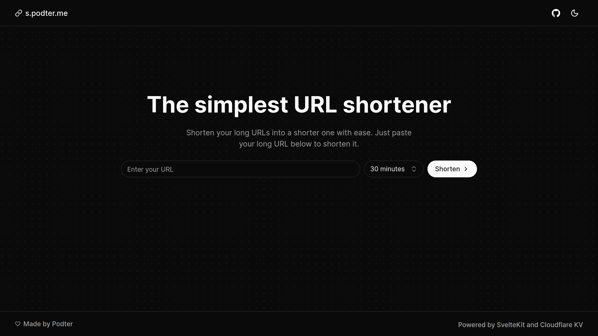

# s.podter.me



The simplest URL shortener. Built with SvelteKit and Cloudflare KV. Deployed on Cloudflare Pages.

https://s.podter.me/

## Features

- Fast and simple
- No registration required
- QR code generation
- URL expiration

## Getting Started

First, run the development server:

```bash
pnpm dev
```

Open [http://localhost:5173](http://localhost:5173) with your browser to see the result.

## License

This project is licensed under the MIT license. See the [LICENSE](LICENSE) file for more information.
